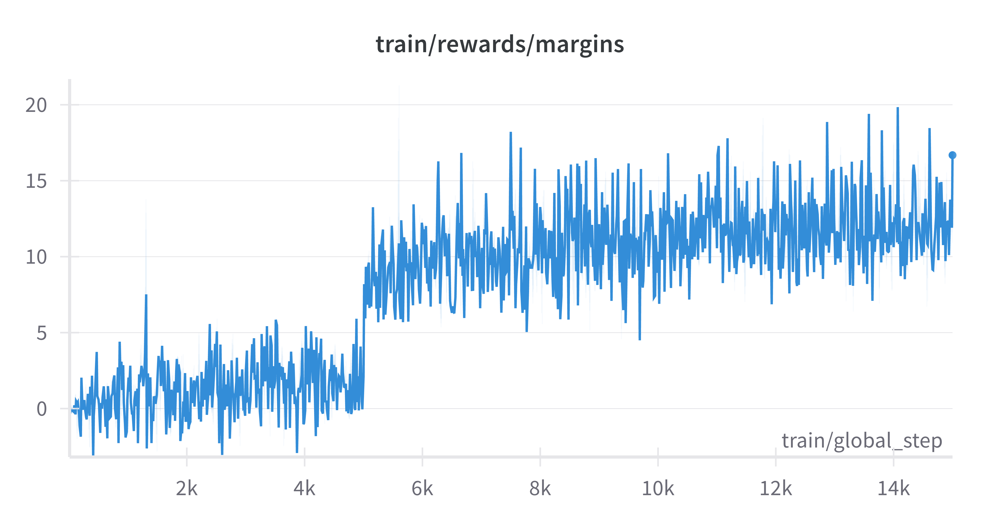
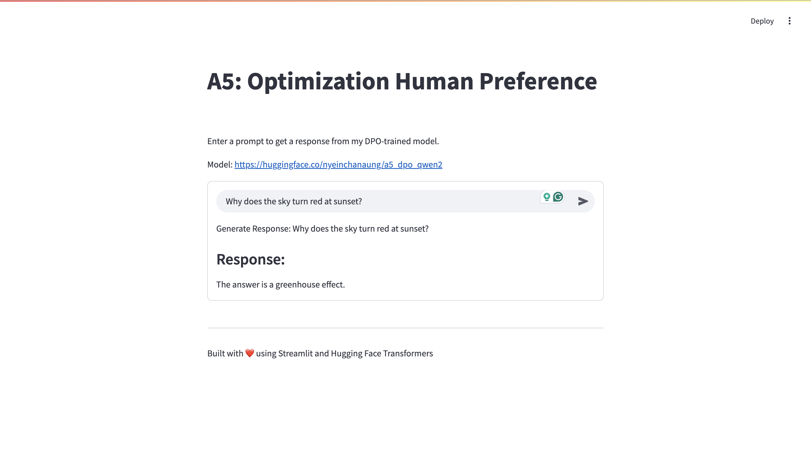

# NLP-A5-DPO
### NLP Assignment 5: Optimization Human Preference
#### AT82.05 Artificial Intelligence: Natural Language Understanding (NLU)

## GitHubLink:
- https://github.com/Nyeinchanaung/NLP-A5-DPO 

## Content
- [Student Information](#student-information)
- [Files Structure](#files-structure)
- [How to run](#how-to-run)
- [Dataset](#dataset)
- [Model Training](#training)
- [Evaluation](#evaluation)
- [Web Application](#application)

## Student Information
 - Name     : Nyein Chan Aung
 - ID       : st125553
 - Program  : DSAI

## Files Structure
1) The Jupytor notebook files
- 04-DPO-Qwen2.ipynb.ipynb

2) `app` folder  
- app.py (streamlit)

 
## How to run
 - Clone the repo
 - Open the project
 - Open the `app` folder
 - `streamlit run app.py`
 - app should be up and run on `http://localhost:8501/`

## Dataset
The `Dahoas/full-hh-rlhf` dataset is an excellent choice for training your model with Direct Preference Optimization (DPO) because it provides a comprehensive, high-quality collection of human preference data specifically curated for reinforcement learning from human feedback (RLHF), which aligns closely with DPO’s objectives.

- **Rich Preference Data:** It contains ~112,000 prompt-response pairs with "chosen" and "rejected" responses, directly matching DPO’s requirement for preference comparisons.
- **Human-Curated Quality:** Sourced from Anthropic’s Helpful-Harmless (HH) RLHF dataset, it’s built from human feedback, ensuring real-world relevance and reliability for training conversational models to be helpful.
- **Large Scale:** With 112,000 samples (split into ~99,000 train, ~13,000 test), it’s significantly larger than your current 10,000-row subset of HuggingFaceH4/ultrafeedback_binarized. 
- **Simplified Structure:** I've also tried with `ultrafeedback_binarized`, but unlikely this dataset had nested "chosen" and "rejected" fields requiring preprocessing, 
- **Proven Utility:** Designed for RLHF and used in research, it’s a proven resource for aligning language models with human preferences,

### Source https://huggingface.co/datasets/Dahoas/full-hh-rlhf 

## Training
### Hyper Parameter
| Hyper Parameter                   | Value     |
|---------------------------------- |-----------|
| vocab_size                        | 5000      |
| batch_size                        | 1         |
| epochs                            | 3         |
| beta                              | 1         |
| logging_steps                     | 10        |
| evaluation_strategy               | epoch     |
| save_strategy                     | epoch     |

### Define hyperparameter

These hyperparameters configure a small-scale fine-tuning run for a language model. The vocab size is limited to 5000, indicating a restricted token set, possibly to fit a domain-specific task. Training uses a very small batch size (1), which might lead to noisy updates, but the model trains for 3 epochs to ensure enough exposure to the data. The beta value of 1 suggests balanced regularization or reward weighting if used in a reinforcement learning context. Logging and evaluation happen every epoch, with progress logged every 10 steps, ensuring regular monitoring. The best model is also saved at the end of each epoch.

## Evaluation
Below is a summary evaluation and key findings based on your model training results for `Qwen2-0.5B-Instruct` with DPO on the `Dahoas/full-hh-rlhf` dataset over 3 epochs. The hyperparameters you provided (batch_size=1, epochs=3, beta=1, etc.) and the training configuration (e.g., small sequence lengths, BF16 on Colab T4) shaped these outcomes.
### Result
| Epoch | Training Loss| Validation Loss| Rewards/chosen| Rewards/rejected | Rewards/accuracies |	Rewards/margins |	Logps/chosen |	Logps/rejected	| Logits/chosen	| Logits/rejected
|-|---------|---------|---------|---------|---------|---------|---------|---------|---------|---------|
1| 	0.860300 |	1.569590 |	-7.679708 |	-9.407799 |	0.605200 |	1.728091 |	-258.907196 |	-264.432648 |	-3.329081 |	-3.418106 |
2| 	0.004500 |	1.794171 |	-10.204892 |	-11.895986 |	0.597200 |	1.691094 |	-284.159027 |	-289.314514 |	-3.410443 |	-3.445873 |
3| 	0.001300 |	1.879734 |	-10.987583 |	-12.683572 |	0.594000 |	1.695989 |	-291.985962 |	-297.190338	 | -3.384251 |	-3.411056 |

### WandD.ai Result

The training plot for train/rewards/margins shows the margin between rewards for "chosen" and "rejected" responses over ~14,000 global steps, corresponding to 3 epochs with a batch size of 1. The margins generally fluctuate between 0 and 20, with a rising trend early on (up to ~6,000 steps), stabilizing around 10-15 after ~8,000 steps. This indicates the model initially learns to distinguish preferences effectively, but the noisy, high variance suggests instability, possibly due to the small batch size or high beta=1, limiting further improvement. The stability post-8,000 steps aligns with your epoch 2-3 metrics, but the variability highlights potential overfitting or data noise.

#### Key Observations:
The training completed successfully across 3 epochs, indicating the memory optimizations (batch size 1, max_length=16) and dataset cleaning were effective. The model shows significant improvement in training loss, but validation loss increased, suggesting overfitting. Rewards and accuracy metrics indicate moderate success in preference learning, though performance stabilized rather than improved after epoch 1.

- Training Loss: Dropped sharply from 0.8603 (epoch 1) to 0.0013 (epoch 3), showing the model learned to minimize the DPO loss on the training set effectively.
- Validation Loss: Rose from 1.5696 (epoch 1) to 1.8797 (epoch 3), a about 20% increase, indicating overfitting—generalization to unseen data worsened over time.
- Rewards/accuracies: Started at 0.6052 (60.52%) and slightly declined to 0.5940 (59.40%), suggesting the model correctly prefers "chosen" over "rejected" ~60% of the time, with no significant improvement after epoch 1.
- Rewards/margins: Remained stable about (1.69-1.73), showing a consistent but modest preference for "chosen" responses across epochs.

#### Conclusion
The training achieved a functional model with ~60% preference accuracy, but overfitting and limited improvement beyond epoch 1 highlight areas for refinement.

## Application
### Application Development
The web application is built using `Streamlit`, a Python framework for creating interactive web apps. This Streamlit app serves as a practical extension of the model training process, bridging the gap between theoretical fine-tuning and real-world usability.

### How to use web app
The application likely provides a user interface where users can:
1) User enters a prompt.
2) The model, embedded in the web app, will tokenizes, encodes, and generates the response.
3) Pretrained model from Hugging Face: https://huggingface.co/nyeinchanaung/a5_dpo_qwen2 

### Screenshots

